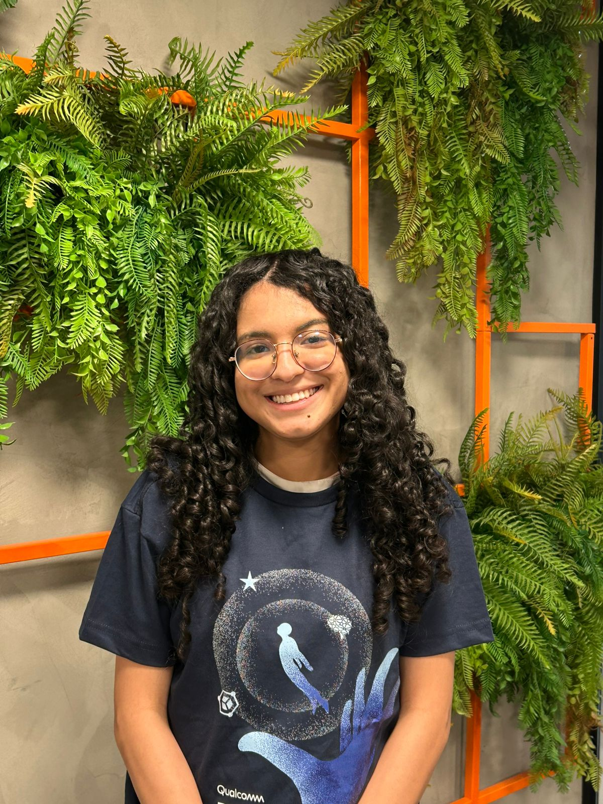
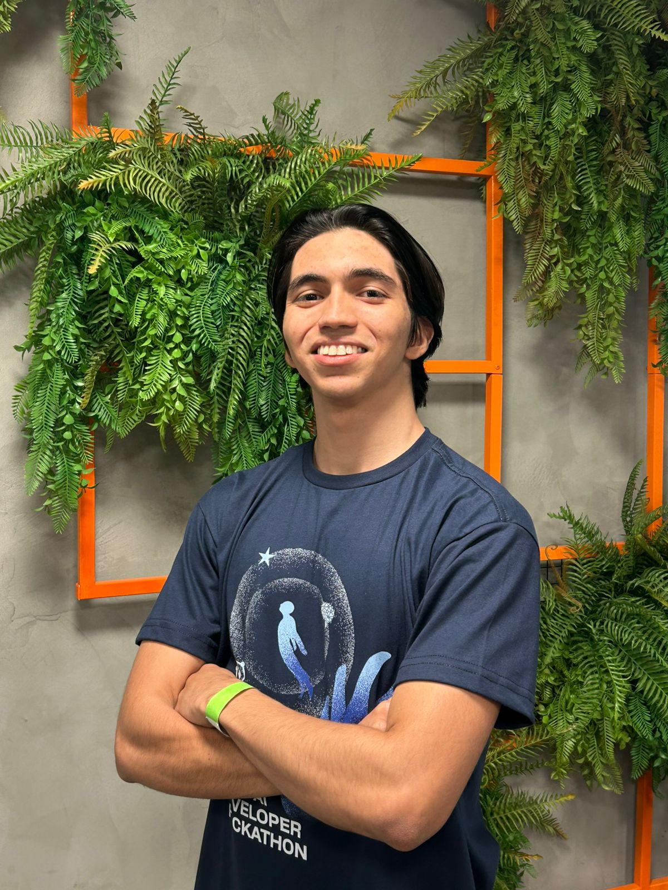
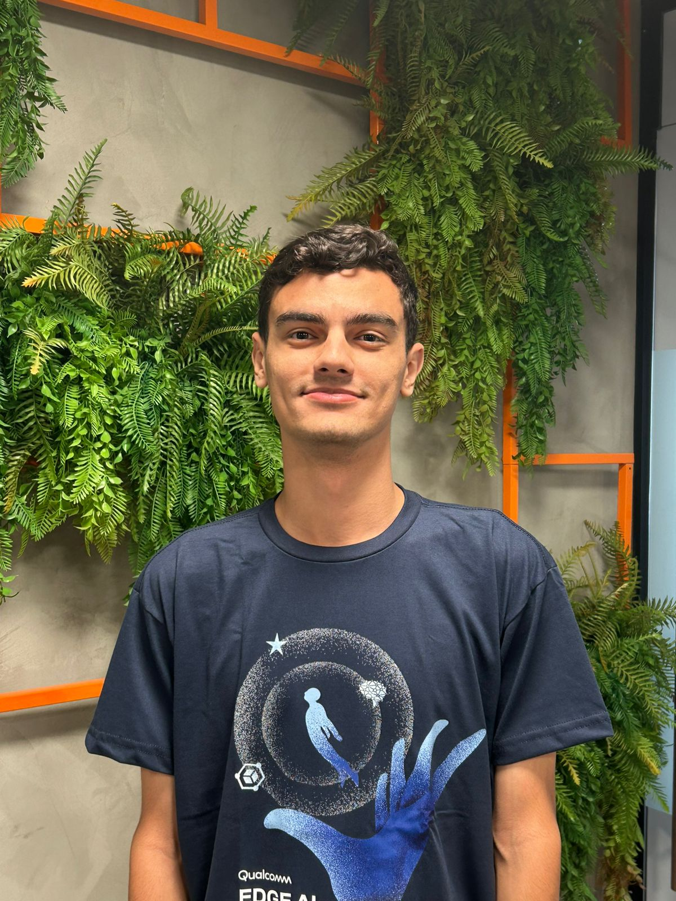
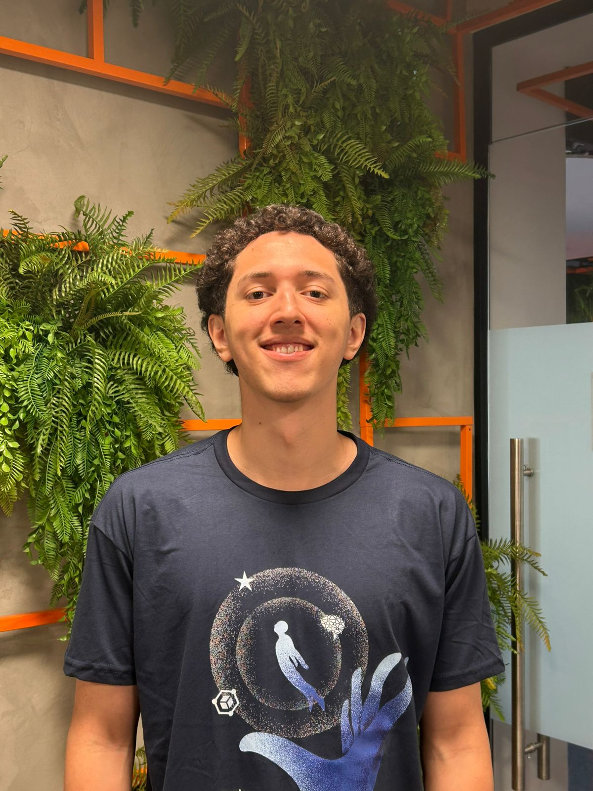
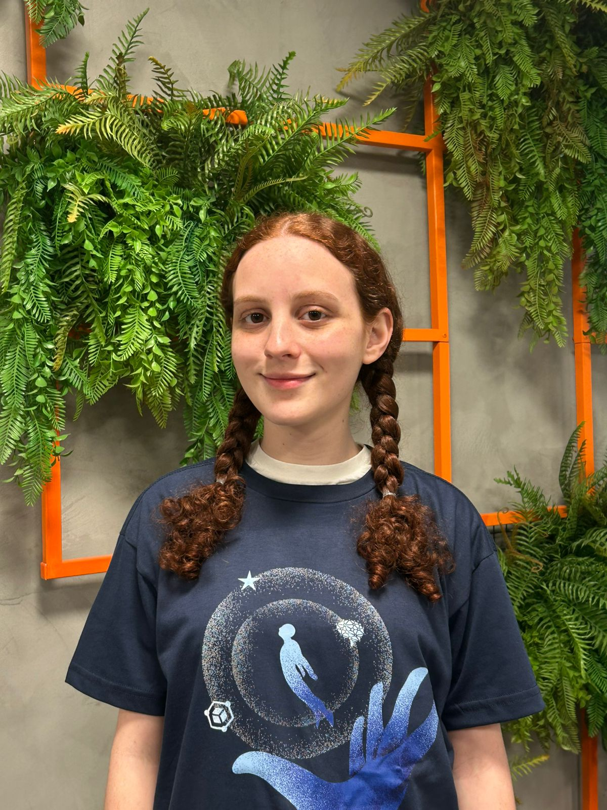
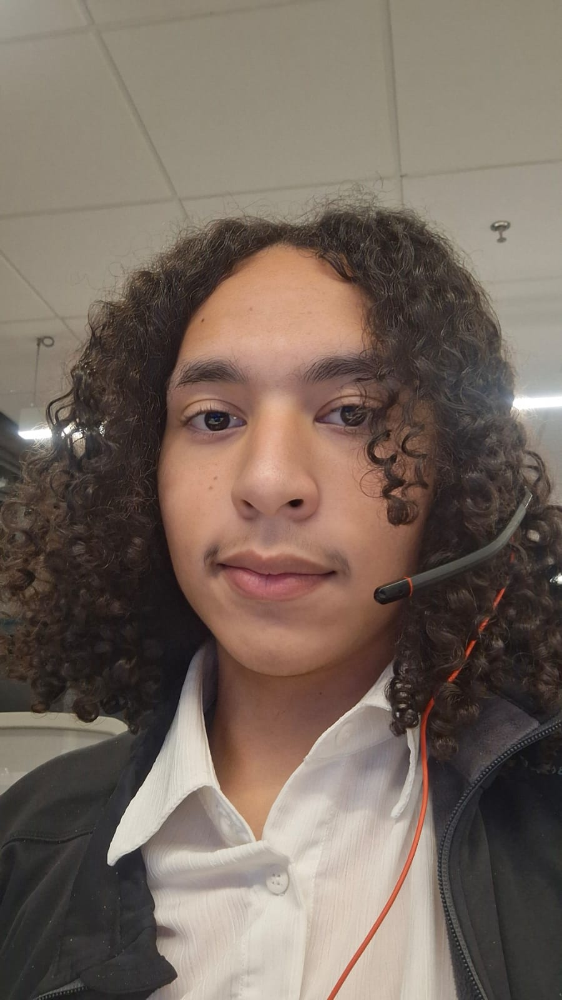

# Edge AI Hackathon - Communication Coach

## 🎯 Sobre o Projeto

# Nome do Projeto: Pitch Pract

## Nome do Grupo: Coditores

Este é um sistema de análise de comunicação em tempo real que utiliza IA para avaliar postura, gestos e contato visual durante apresentações. Otimizado para dispositivos Qualcomm Snapdragon X.

## 🚀 Funcionalidades Principais

- **Análise de Postura**: Avalia alinhamento corporal e posicionamento
- **Detecção de Gestos**: Analisa expressividade e uso de gestos
- **Contato Visual**: Monitora direção do olhar e engajamento
- **Relatórios Detalhados**: Gera análises completas com recomendações
- **Interface Web**: Dashboard interativo com visualizações em tempo real

## 📁 Estrutura do Projeto

 <div align="center">
  <table>
    <tr>
     <td align="center"><a href="https://www.linkedin.com/in/ana-cristina-jardim/"><br><sub><b>Ana Cristina</b></sub></a></td>
     <td align="center"><a href="https://www.linkedin.com/in/carlosicaro"><br><sub><b>Carlos Icaro</b></sub></a></td>
     <td align="center"><a href="https://www.linkedin.com/in/ifelipemartins"><br><sub><b>Felipe Martins</b></sub></a></td>
     <td align="center"><a href="https://www.linkedin.com/in/gustavo-martinsg"><br><sub><b>Gustavo Martins</b></sub></a></td>
     <td align="center"><a href="https://www.linkedin.com/in/lavinia-mendonca/"><br><sub><b>Lavinia Mendonça</b></sub></a></td>
     <td align="center"><a href="https://www.linkedin.com/in/marcos-vinicius-m-silva/"><br><sub><b>Marcos Marcondes</b></sub></a></td>
     

  </table>
</div>

## 📝 Descrição

&emsp;A nossa ferramenta analisa a comunicação oral e a linguagem não verbal para fornecer feedback sobre postura, entonação, ritmo de fala e sinais de nervosismo, apresentando métricas visuais de performance de forma intuitiva. Diferente de métodos tradicionais, o modelo roda diretamente no dispositivo, garantindo privacidade total, reduzindo custos e permitindo uso mesmo sem conexão com a internet. Combinando análise multimodal e simulações realistas, a solução prepara líderes, executivos e empreendedores para apresentações críticas de forma prática, acessível e eficaz.

## 📝 Vídeo demonstrativo

Clique [https://www.youtube.com/shorts/CNqhdcmNrjc](Vídeo) para acessar o vídeo demonstrativo da ferramenta.

## 📁 Estrutura de Pastas

Entre os arquivos e pastas presentes na raiz do projeto, estão definidos os seguintes:

```plaintext
edge-ai-hackathon/
│
├── assets/                           # Elementos visuais e imagens
│   ├── fotos/                        # Fotos dos desenvolvedores do projeto
│   └── personas/                     # Imagens das personas e user stories
│       ├── 3w3c.png
│       ├── invest.png
│       ├── persona1.png
│       ├── persona2.png
│       └── persona3.png
│
├── app/                          # Aplicação principal
│   ├── core/                     # Lógica de negócio
│   ├── utils/                    # Utilitários
│   ├── static/                   # Arquivos estáticos
│   │   ├── css/
│   │   └── js/
│   ├── templates/                # Templates HTML
│   └── requirements.txt          # Dependências
│
├── docs/                        # Documentação complementar
│   └── documentacao.md               # Documento principal do projeto
│
├── LICENSE                           # Licença do projeto
└── README.md                         # Documentação do projeto
```

## 🛠️ Instalação

1. **Clone o repositório**:
```bash
git clone <repository-url>
cd edge-ai-hackathon
```

2. **Instale as dependências**:
```bash
cd app
pip install -r requirements.txt
```

3. **Execute a aplicação**:
```bash
python run.py
```

4. **Acesse no navegador**:
```
http://localhost:5000
```

## 🎥 Como Usar

1. **Inicie uma sessão**: Clique em "Start Coaching"
2. **Posicione-se**: Fique em frente à câmera
3. **Apresente**: Fale naturalmente como em uma apresentação
4. **Monitore**: Acompanhe suas métricas em tempo real
5. **Analise**: Veja o relatório final com recomendações

## 🔧 Requisitos do Sistema

- **Sistema Operacional**: Windows 10/11
- **Processador**: Qualcomm Snapdragon X (recomendado)
- **Câmera**: Webcam funcional
- **Python**: 3.8+
- **RAM**: 4GB mínimo

## 📊 Tecnologias Utilizadas

- **Backend**: Flask, SocketIO
- **IA**: MediaPipe, OpenCV
- **Frontend**: HTML5, CSS3, JavaScript
- **Visualização**: Plotly, Chart.js
- **Otimização**: Qualcomm Snapdragon X

## 🤝 Contribuição

1. Fork o projeto
2. Crie uma branch para sua feature
3. Commit suas mudanças
4. Push para a branch
5. Abra um Pull Request

## 📄 Licença

Este projeto está sob a licença MIT. Veja o arquivo [LICENSE](LICENSE) para mais detalhes.

## 🆘 Suporte

Para dúvidas ou problemas:
- Abra uma issue no GitHub
- Consulte a documentação em `/docs`
- Verifique o [QUICK_START.md](QUICK_START.md)

---

**Desenvolvido para o Edge AI Hackathon - Qualcomm**

