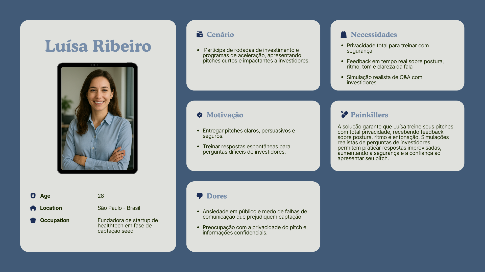

# Documentação Modelo Preditivo - Inteli

```
INSTRUÇÕES GERAIS (remova este trecho ao final)

Você deve editar este documento utilizando notação markdown - siga as convenções neste link 
https://docs.github.com/en/get-started/writing-on-github/getting-started-with-writing-and-formatting-on-github/basic-writing-and-formatting-syntax
```

## Nome da Solução
### Nome do grupo
#### (preencha aqui os nomes dos integrantes, em ordem alfabética, separados por vírgula)

## Sumário
[1. Introdução](#c1)

[2. Objetivos e Justificativa](#c2)

[3. Metodologia](#c3)

[4. Desenvolvimento e Resultados](#c4)

[5. Conclusões e Recomendações](#c5)

[6. Referências](#c6)

[Anexos](#attachments)


## <a name="c1"></a>1. Introdução
```
Apresente de forma sucinta o parceiro de negócio, seu porte, local, área de atuação e posicionamento no mercado. Maiores detalhes deverão ser descritos na seção 4. Descreva resumidamente o problema a ser resolvido (sem ainda mencionar a solução). 

Remova este bloco ao final
```

## <a name="c2"></a>2. Objetivos e Justificativa
### 2.1 Objetivos
```
Descreva resumidamente os objetivos gerais e específicos do seu parceiro de negócios.

Remova este bloco ao final
```

### 2.2 Proposta de solução
```
Descreva resumidamente sua proposta de modelo preditivo e como esse modelo pretende resolver o problema, atendendo os objetivos.

Remova este bloco ao final
```

### 2.3 Justificativa
```
Faça uma breve defesa de sua proposta de solução, escreva sobre seus potenciais, seus benefícios e como ela se diferencia.

Remova este bloco ao final
```

## <a name="c4"></a>4. Desenvolvimento e Resultados
### 4.1.1. Contexto da indústria 
```
Descreva aqui o Contexto Setorial

```

### 4.1.3. Planejamento Geral da Solução

a) quais os dados disponíveis (fonte e conteúdo - exemplo: dados da área de Compras da empresa descrevendo seus fornecedores).
b) qual a solução proposta (pode ser um resumo do texto da Seção 2.2).
c) como a solução proposta deverá ser utilizada.
d) quais os benefícios trazidos pela solução proposta.
e) qual será o critério de sucesso.

Remova este bloco ao final


### 4.1.5. Público Alvo

&emsp;A definição de público-alvo é um elemento essencial no desenvolvimento de uma solução tecnológica. Ela orienta não apenas o design da experiência do usuário, mas também a narrativa de valor do produto, os canais de distribuição e a própria viabilidade de mercado. Conhecer com clareza quem são os potenciais usuários, quais dores compartilham e de que forma sua solução se conecta a essas necessidades é o que diferencia uma ideia promissora de um produto com real aderência. No caso de uma ferramenta voltada para análise e aprimoramento da comunicação em pitches de vendas e captação, compreender os perfis que mais se beneficiam dessa proposta é fundamental para guiar tanto o desenvolvimento técnico quanto a estratégia de posicionamento.

&emsp;Quando pensamos sobre o público que melhor aproveitaria a ferramenta sendo desenvolvida, três principais grupos se destacam: líderes de área, executivos e gestores, e empreendedores. Ainda que em contextos diferentes, o problema central compartilhado pelos grupos é o mesmo: a efetividade na comunicação durante a transmissão de ideias. Todos enfrentam situações em que o peso de uma apresentação é determinante para conquistar apoio, gerar confiança ou obter recursos.

&emsp;Os líderes de área se deparam com o desafio de defender projetos estratégicos dentro de suas organizações, precisando transmitir clareza e segurança para diretoria e stakeholders internos. Já os executivos e gestores têm como prioridade a manutenção de sua credibilidade em apresentações de alto impacto, sejam relatórios de resultados, reuniões com clientes ou interações com conselhos. Por fim, os empreendedores representam o grupo com maior urgência: seu sucesso em captar investimentos depende diretamente de um pitch bem executado e da forma como sua ideia é comunicada; sua preocupação com a privacidade é ainda mais crítica, já que envolve a exposição de informações confidenciais sobre o negócio.

&emsp;Apesar das diferenças de contexto, esses três perfis convergem em três necessidades centrais: aprimorar a performance de comunicação em pitches, garantir a confidencialidade de informações estratégicas e acessar uma experiência de treinamento realista e integrada. A solução proposta se posiciona justamente na interseção dessas demandas, oferecendo privacidade, análise aprofundada da performance comunicativa e treinamento interativo orientado a cenários do mundo real.

### 4.1.6. Personas

&emsp;A construção de personas é uma etapa essencial para transformar o público-alvo em perfis concretos e representativos, permitindo compreender de forma mais detalhada as necessidades, dores e objetivos dos usuários. No contexto deste projeto, as personas ajudam a orientar o desenvolvimento da ferramenta, garantindo que as funcionalidades ofereçam valor real e resolvam questões específicas de comunicação em pitches.

&emsp;Cada persona a seguir representa um segmento distinto do público-alvo — líderes de área, executivos e gestores, e empreendedores — e permite visualizar como diferentes perfis interagem com a solução, quais são suas expectativas e como a ferramenta pode atuar como um verdadeiro aliviador de dores, ajudando-os a aprimorar a performance comunicativa, treinar em ambientes realistas e manter a privacidade de informações estratégicas.

<div style="text-align: center;">
  

  

  

</div>


### 4.1.7. User Story

&emsp;A user story é fundamental no desenvolvimento de produtos, pois transforma uma necessidade ou expectativa do usuário em um requisito claro e compreensível. Ela ajuda a equipe a entender quem é o usuário, o que ele deseja realizar e por que isso é importante, garantindo que a funcionalidade desenvolvida entregue valor real. Além disso, a user story serve como ponto de partida para discussões, refinamentos e testes, permitindo priorizar tarefas, planejar iterações e criar soluções alinhadas às demandas do público-alvo. Ao manter o foco no usuário, ela fortalece a conexão entre desenvolvimento técnico e experiência prática, tornando o produto mais efetivo e aderente às necessidades do mercado.

<div style="text-align: center;">

  

</div>

&emsp;

&emsp;A composição de User Stories conta, ainda, com uma análise INVEST, uma metodologia utilizada para avaliar a qualidade de uma user story, garantindo que ela seja independente, negociável, valiosa, estimável, adequada ao tamanho e testável. Cada critério ajuda a tornar a história clara, focada no usuário e pronta para implementação: ser independente evita dependências desnecessárias; ser negociável mantém flexibilidade na forma de entrega; ser valiosa garante que a funcionalidade entregue benefício real; ser estimável permite planejar esforço e recursos; estar adequadamente dimensionada facilita sua conclusão em iterações curtas; e ser testável assegura que critérios de aceitação possam ser verificados. Ao aplicar o INVEST, a equipe consegue priorizar, planejar e validar histórias de forma mais eficiente, aumentando a qualidade do desenvolvimento e a aderência às necessidades do usuário.

<div style="text-align: center;">

  

</div>


### 4.5. Avaliação
```
- Descreva a solução final de modelo preditivo e justifique a escolha. Alinhe sua justificativa com a Seção 4.1, resgatando o entendimento 
  do negócio e das personas, explicando de que formas seu modelo atende os requisitos e definições. 
- Descreva também um plano de contingência para os casos em que o modelo falhar em suas predições.
- Além disso, discuta sobre a explicabilidade do modelo (se aplicável) e realize a verificação de aceitação ou refutação das hipóteses.
- Se aplicável, utilize equações, tabelas e gráficos de visualização de dados para melhor ilustrar seus argumentos. 

Remova este bloco ao final
```

## <a name="c5"></a>5. Conclusões e Recomendações
```
Escreva, de forma resumida, sobre os principais resultados do seu projeto e faça recomendações formais ao seu parceiro de negócios em relação ao uso desse modelo. Você pode aproveitar este espaço para comentar sobre possíveis materiais extras, como um manual de usuário mais detalhado na seção “Anexos”. Não se esqueça também das pessoas que serão potencialmente afetadas pelas decisões do modelo preditivo e elabore recomendações que ajudem seu parceiro a tratá-las de maneira estratégica e ética. 

Remova este bloco ao final
```

## <a name="c6"></a>6. Referências
```
Incluir as principais referências de seu projeto, para que seu parceiro possa consultar caso ele se interessar em aprofundar. Não se esqueça de formatar as referências conforme a ABNT.

Remova este bloco ao final
```

## <a name="attachments"></a>Anexos
```
Utilize esta seção para anexar materiais como manuais de usuário, documentos complementares que ficaram grandes e não couberam no corpo do texto etc.

Remova este bloco ao final
```
